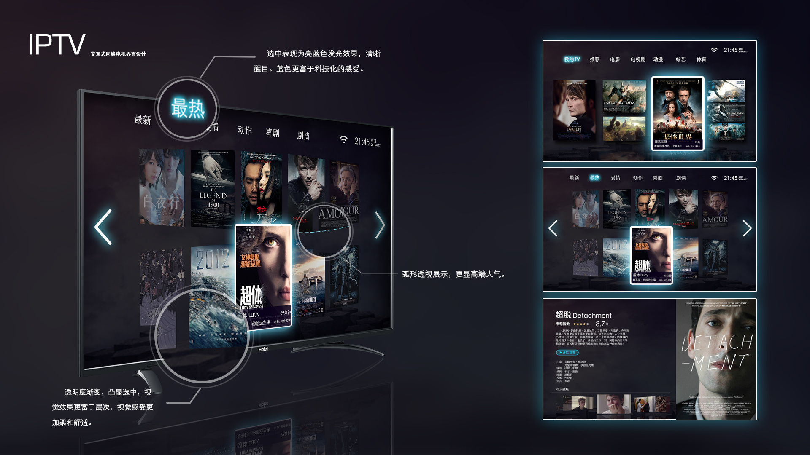
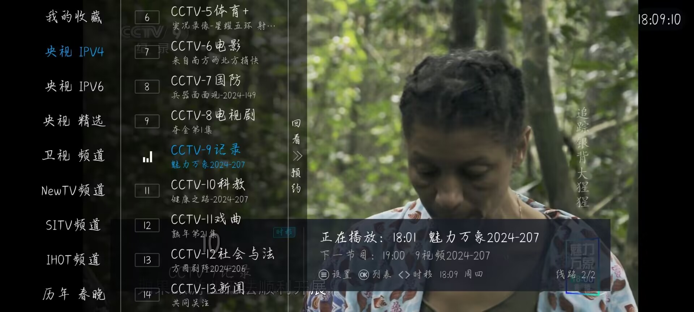
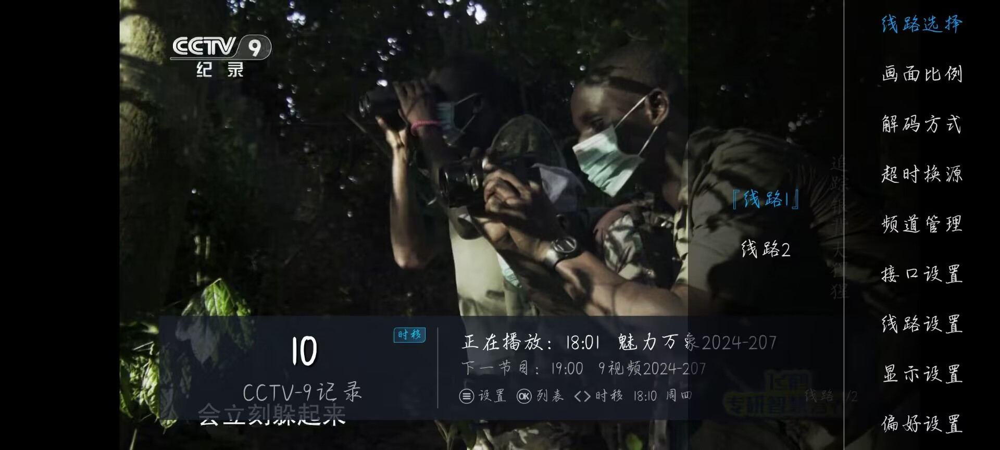

<h1 align="center"> ✯ 一个影视接口 ✯ </h1>
<h3 align="center">🔕 永久免费 直连访问 完整开源 不断完善 支持IPv4/IPv6双栈访问 🔕</h3>

---

## 🌇软件推荐：

|  app  |                                        下载地址                                        | 最后更新   |
|-------|----------------------------------------------------------------------------------------|-----------|
|  明日直播  | [https://wwwlhb.lanzouj.com/iwIc6251crjc](https://wwwlhb.lanzouj.com/iwIc6251crjc) | 2024.7.20 |
|  明日影视  | [https://wwwlhb.lanzouj.com/inYxf253ohuh](https://wwwlhb.lanzouj.com/inYxf253ohuh) | 2024.7.20 |
|  EasyBox  | [https://wwwlhb.lanzouj.com/iJEe020vghmj](https://wwwlhb.lanzouj.com/iJEe020vghmj) | 2024.7.20 |
|  影迷app  | [https://wwwlhb.lanzouj.com/ikCeO251d88d](https://wwwlhb.lanzouj.com/ikCeO251d88d) | 2024.7.20 |

|     PC   |                                     下载地址                                        | 最后更新   |
|----------|-------------------------------------------------------------------------------------|-----------|
|  ZyPlayer| [https://github.com/Hiram-Wong/ZyPlayer](https://github.com/Hiram-Wong/ZyPlayer)    | 2024.7.24 |

|   ipad   |                                     下载地址                                        | 最后更新   |
|----------|-------------------------------------------------------------------------------------|-----------|
|   iBox   | [https://wwwlhb.lanzouj.com/iOubo25fg54d](https://wwwlhb.lanzouj.com/iOubo25fg54d)  | 2024.7.24 |

### 🖼️ 屏幕截图预览

展开查看软件截图

|                            EsayBox(首页)                            |                            EsayBox(接口)                             |
| :-----------------------------------------------------------------: | :------------------------------------------------------------------: |
|  |                   |
|                            明日(直播)                                |                            明日(设置)                                |
|   |                        |
|                            ZyPlayer(首页)                            |                            ZyPlayer(播放)                            |
|  |  |

> 配置 接口：
  -  [Gitee](https://gitee.com/soundy-dust/cat_tv/raw/master/api/api.json)
  -  [GitHub](https://github.moeyy.xyz/https://raw.githubusercontent.com/CatBoxs/Cat_tv/main/api/api.json)

## 🛠️工具
- 📆**EPG接口地址**：
  -  [https://live.fanmingming.com/e.xml](https://live.fanmingming.com/e.xml)
- 🏞️**节目单接口**：
  -  [https://epg.112114.free.hr/](https://epg.112114.free.hr/)
- 🆕**TXT转M3U格式**：
  - [https://live.fanmingming.com/txt2m3u](https://live.fanmingming.com/txt2m3u)

## 📖说明
- EasyBox和影视迷app需通过配置接口进行配置。
- 明日直播内置CCTV直播接口，也可通过自定义源来更改你所需要要的源；明日影视内置影视接口，无需配置。
- 直播源格式可参考[https://gitee.com/soundy-dust/cat_tv/raw/master/api/tv.txt](https://gitee.com/soundy-dust/cat_tv/raw/master/api/tv.txt)。
- TXT转M3U工具为前端网页转换，无需上传文件，粘贴即转换，安全不偷源。
- Gitee域名【`https://gitee.com/soundy-dust/cat_tv`】的WEB访问通过Gitee Pages自动构建，由CloudFlare提供CDN和安全防护。
- GitHub域名【`https://github.com/CatBoxs/Cat_tv`】通过Github Actions自动构建在CloudFlare Pages。
- 项目所有接口来源于网络，不存在影视数据生产及保存，所有的法律责任与后果应由使用者自行承担。

## 📱联系
- QQ: [您不需要联系我，觉得不错，给个star就行哦]()

## 📔更新
- 2024.7.20
  - 对api接口内容进行更改，去除无用的影视接口。

## 🌐 注：
- 明日直播由QQ：抢先服（3095964998）提供二改;
- 明日影视是如意二开版，配置如意后台;
- EsayBox和影迷暂未找到由哪位大佬开发;
- ZyPlayer可通过PC端下载接口，查看大佬的GitHub账号进行下载;
- 该README.md模版来源于fanmingming，如需EPG接口可访问：[https://live.fanmingming.com/](https://live.fanmingming.com/)。
